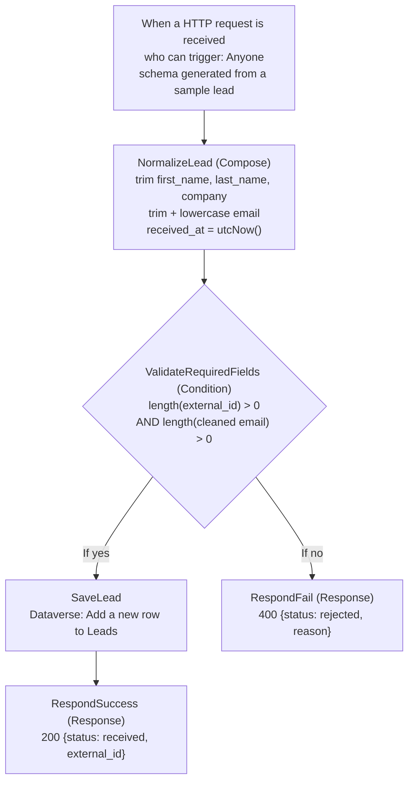

# Rivertown Lead Intake - Power Automate rebuild (v1)

The first half of the n8n Lead Intake build (receive, clean, check, save, reply), rebuilt in Microsoft Power Automate and Dataverse for the master calendar's Week 6 cross-platform comparison. Built and tested 2026-09-30 in a Power Apps Developer Plan environment. All data is synthetic; Rivertown Professional Services is fictional.

Not included yet (later blocks): duplicate check, AI triage, routing, audit trail, approvals.

## Files

| File | Contents |
|---|---|
| `RivertownLeadIntake_1_0_0_1.zip` | Unmanaged solution export: Lead table, the flow, the Dataverse connection reference. Scanned before commit: no flow address, no signature, no account names. |

## The flow

Same contract as the n8n build: only external_id and email are required (decision D4), and cleaning happens before the check (D5).

## n8n to Power Automate terms

| n8n | Power Automate | Note |
|---|---|---|
| Workflow | Cloud flow | |
| Node | Action (the first one is the trigger) | |
| Webhook node | When a HTTP request is received | Premium |
| Header Auth credential (API key in a header) | "Who can trigger: Anyone": a signed web address (`sig=`) is the key | Tenant options require an OAuth token from the organization |
| Credential | Connection (the stored key) and connection reference (the label inside a solution) | The reference travels in the export; each environment plugs in its own connection |
| Edit Fields (Set) | Compose | |
| IF | Condition (If yes / If no) | |
| Respond to Webhook | Response | Premium |
| Data Table | Dataverse table | Dataverse enforces column types, lengths, and dependencies |
| Expression `{{ }}`, `$json.body.x` | Expression (fx tag), `triggerBody()?['x']` | Typed text is literal; only an fx tag is evaluated |
| `$('Node').item.json.x` | `outputs('Node')?['x']` | Needed when the step is not the previous one |
| `?.` and `?? ''` | `?[...]` and `coalesce(x, '')` | Missing field gives empty, not an error |
| Executions list | 28-day run history | Duration alone showed which path ran |
| Execution ID | Run's client tracking ID | Power Automate stamps it on every run |
| Publish / unpublish | Save turns the flow on; Turn off / Turn on | |
| Workflow JSON export | Solution export (zip), unmanaged | |

## Lead table field map

| Column (display) | Technical name | Type | Value comes from |
|---|---|---|---|
| external_id (primary column) | jdm_externalid | Text | Form, as received |
| first_name | jdm_firstname | Text | NormalizeLead (trimmed) |
| last_name | jdm_lastname | Text | NormalizeLead (trimmed) |
| email | jdm_emailaddress | Email | NormalizeLead (trimmed, lowercase) |
| company | jdm_companyname | Text | NormalizeLead (trimmed) |
| phone | jdm_phonenumber | Phone | Form, as received |
| engagement_type | jdm_engagementtype | Text | Form, as received |
| company_size | jdm_company_size | Text | Form, as received |
| message | jdm_inquirymessage | Text, max 4,000 | Form, as received |
| submitted_at | jdm_submissiontimestamp | Date and time | Form, as received |
| received_at | jdm_receivedtimestamp | Date and time | NormalizeLead (utcNow) |
| status | jdm_inquirystatus | Choice | Not written yet |
| routed_to | jdm_routeddepartment | Choice | Not written yet |
| duplicate_count | jdm_duplicatecount | Whole number | Not written yet |

Rule used for column types: input from outside (the website form) is stored as text, exactly as received; dropdowns (Choice) only for values Rivertown controls. A Choice column rejects any value not on its list, which would lose the lead.

The technical names were chosen by the import's AI and differ from the display names. Dataverse adds its own system columns (owner, created on, and others).

## Tests (2026-09-30)

Pass/fail rules were written before the runs. Results: test-cases.md, "2026-09-30 - Power Automate rebuild". All three passed.

## Running it

- The flow's web address is the password. It is kept outside the repo; never paste it into chat, screenshots, or the repo.
- Send with the Postman desktop app: POST, Body raw JSON, header Content-Type application/json.
- Importing this solution elsewhere generates a new web address and asks for a Dataverse connection for the connection reference.
- Licensing: the HTTP trigger, Response, and Dataverse are Premium. Free in the Developer Plan; a paid license cost for a real client.
